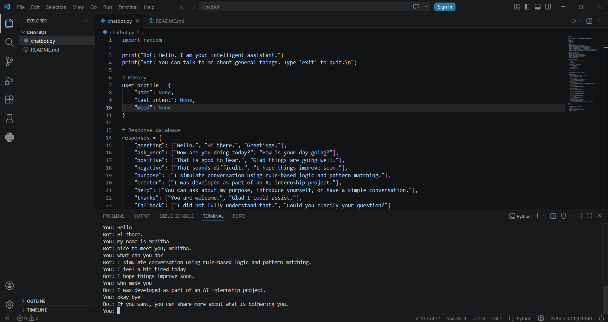

# CodSoft AI Internship Projects

This repository contains all the tasks completed as part of the CodSoft AI Internship. Each task demonstrates different concepts in Artificial Intelligence, Machine Learning, and Computer Vision.

## Task 1: Rule-Based Chatbot
Developed a chatbot using Python that responds to user inputs based on predefined rules and keyword matching. The system identifies user intent and generates appropriate responses without using machine learning models.

## Key Features
- Rule-based response system using conditional logic
- Keyword-based intent recognition
- Handles basic conversational queries
- Simple and structured implementation

### Output

## Task 2: Tic-Tac-Toe AI
Implemented an AI-powered Tic-Tac-Toe game where a human player competes against an intelligent agent. The AI analyzes the game state and selects optimal moves.

### Key Features
- Human vs AI gameplay
- Intelligent decision-making logic
- Modular design with separate logic and interface
- Interactive command-line execution

### Output
)

## Task 3: Image Captioning AI
Built an AI system that generates captions for images by combining Computer Vision and Natural Language Processing techniques.

### Key Features
- Feature extraction using pre-trained CNN models
- Caption generation based on image content
- Integration of vision and language models
- Modular implementation

### Output

## Task 4: Recommendation System
Developed a recommendation system that suggests items based on user preferences and similarity patterns.

### Key Features
- Personalized recommendations
- Similarity-based approach
- Efficient data handling
- Practical application of AI concepts

### Output

## Task 5: Face Detection System
Implemented a face detection system using OpenCV and Haar Cascade classifier. The system detects faces in images and performs additional operations.

### Key Features
- Face detection using Haar Cascade
- Filtering using aspect ratio
- Bounding box visualization
- Face blurring, cropping, and counting

### Output

## Technologies Used
- Python
- OpenCV
- NumPy
- Basic Machine Learning concepts
- Computer Vision techniques
- Natural Language Processing concepts

## Conclusion
These projects collectively demonstrate the application of AI concepts across different domains including conversational systems, game AI, computer vision, and recommendation systems.
