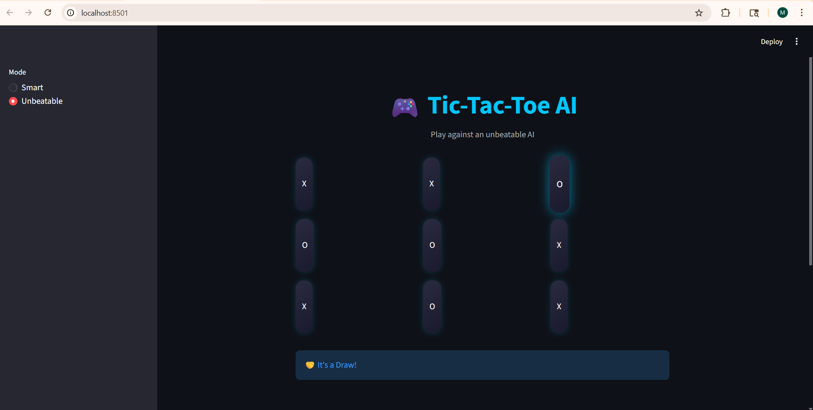

# Task 2: Tic-Tac-Toe AI

## 📌 Description
This project implements an AI-powered Tic-Tac-Toe game using Python, where a human player competes against an intelligent AI agent.

The project follows a modular approach by separating the user interface and AI logic into different files:
- app.py handles the game flow and user interaction
- model.py contains the AI decision-making logic

The AI analyzes the current game state and selects optimal moves, making it a challenging opponent.

---

## 🚀 Features
- Human vs AI gameplay
- Intelligent move selection by AI
- Clean and interactive command-line interface
- Modular code structure (UI + logic separation)

---

## 🛠️ Technologies Used
- Python

---

## ▶️ How to Run
1. Install Python
2. Open terminal or command prompt
3. Navigate to the project folder
4. Run the program:
   python app.py

---

## 📷 Output

---

## 📂 Project Structure
tic_tac_toe/
│── app.py
│── model.py
│── README.md
│── tic_output.png

---

## 🧠 AI Approach
The AI evaluates the current board state and chooses the best possible move to either win the game or block the opponent.