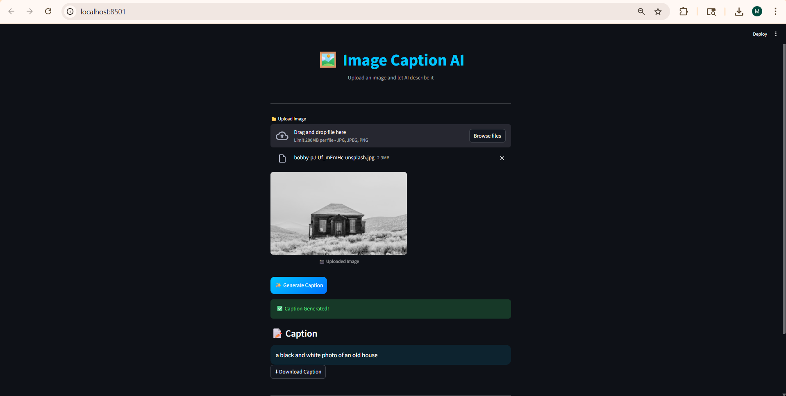

# Task 3: Image Captioning AI

## Description
This project combines Computer Vision and Natural Language Processing to automatically generate captions for images.

A pre-trained Convolutional Neural Network (CNN) such as VGG/ResNet is used to extract visual features from images. These features are then passed to a language model to generate meaningful textual descriptions.

## Features
- Generates captions for input images
- Uses deep learning for feature extraction
- Combines vision + language models
- Clean modular structure (app.py + model.py)

## Technologies Used
- Python
- CNN (VGG / ResNet)
- NLP techniques (RNN / Transformer)
- Deep Learning Libraries

## How to Run
1. Install dependencies:
   pip install -r requirements.txt

2. Run the application:
   python app.py

## Output

## Working Principle
The model first extracts features from the image using a pre-trained CNN.  
These features are then processed by a language model which generates a caption word-by-word based on the visual context.

## 🎯 Applications
- Assistive technology (for visually impaired users)
- Image search and indexing
- Social media automation