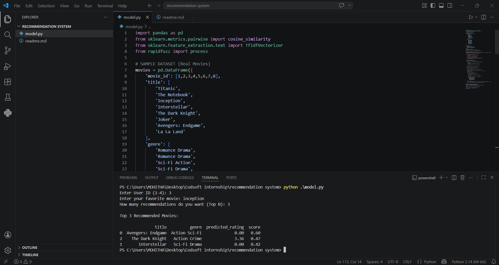

#  Movie Recommendation System

## Overview

This project is a **Hybrid Recommendation System** that suggests movies to users based on their preferences. It combines:

*  Collaborative Filtering (User behavior)
* Content-Based Filtering (Movie features)
*  TF-IDF for better text understanding
*  Fuzzy Matching for user-friendly input

## Features

*  Personalized movie recommendations
*  Handles typos and case-insensitive input
*  Predicts user ratings for unseen movies
*  Top-N recommendations (Top 5, Top 10, etc.)
*  Hybrid model for better accuracy

## Technologies Used

* Python
* Pandas
* Scikit-learn
* TF-IDF Vectorizer
* Cosine Similarity
* RapidFuzz (for fuzzy matching)

## How It Works

1. User inputs:

   * User ID
   * Favorite movie
   * Number of recommendations

2. System:

   * Finds closest movie match
   * Computes similarity using TF-IDF
   * Predicts ratings using collaborative filtering
   * Combines both using hybrid scoring

3. Outputs:

   * Recommended movies
   * Genre
   * Predicted rating
   * Final hybrid score

## Applications

* Movie streaming platforms (Netflix, Prime)
* E-commerce recommendation systems
* Personalized content suggestion systems

## output

##  Conclusion

This project demonstrates how combining multiple recommendation techniques improves accuracy and user experience.

